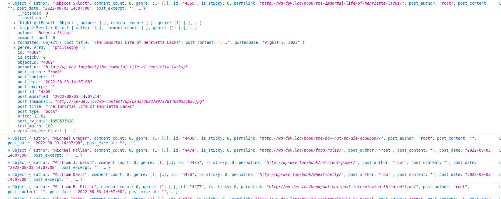

## Customizing the default results template in instant-search module

###Use case: 
Suppose you added a new field for instance `price` in your schema and indexed it to TypeSense server. Now how to show the price in the result template?

To show the price in result tempalte, follow the steps below:

### 1. Register a custom template for your index type

First you have to register the custom template for your index type. The important part here is the `id` of the template.
If you look at the code below, notice the id of the script is `tmpl-cmswt-Result-itemTemplate--book`. The last part of the `id` must be value of the index type you are registering with the hook `cm_typesense_available_post_types`.

```
<?php
function cm_202208_add_book_hit_template() { ?>
    <script type="text/html" id="tmpl-cmswt-Result-itemTemplate--book">
        <div class="hit-header">
            <# if(data.post_thumbnail !== undefined) { #>
            <a href="{{{data._highlightResult.permalink.value}}}" class="hit-header--link" rel="nofollow noopener">
                
            </a>
            <# } #>
        </div>
        <div class="hit-content">
            <a href="{{{data._highlightResult.permalink.value}}}" rel="nofollow noopener"><h5 class="title">{{{data.formatted.post_title}}}</h5></a>
            <# if( data.post_type === 'book' ) { #>
            <div class="hit-meta">
                    <span class="posted-on">
                        <time datetime="">{{data.formatted.postedDate}}</time>
                    </span>
                <# if ( Object.keys(data.formatted.cats).length > 0 ) { #>
                <div class="hit-cats">
                    <# for ( let key in data.formatted.cats ) { #>
                    <div class="hit-cat"><a href="{{{data.formatted.cats[key]}}}">{{{key}}}</a>,</div>
                    <# } #>
                </div>
                <# } #>
                <# } #>
                <div class="hit-description">{{{data.formatted.post_content}}}</div>
                <div class="hit-link">
                    <a href="{{data.permalink}}"><?php _e( 'Read More...', 'search-with-typesense' ); ?></a>
                </div>
            </div>
        </div>
    </script>
<?php
}
add_action( 'wp_footer', 'cm_202208_add_book_hit_template' );
```
*Note: The template above is the default template.*

### 2. Showing the custom field

In our case we want to show our custom field `price`, for that we change the above code by adding this line:
<br />`<span class="price">Price: ${{{data.price}}}</span>`


```
<?php
function your_prefix_custom_hits() {
    ?>
    <script type="text/html" id="tmpl-cmswt-Result-itemTemplate--default">
	    <div class="hit-header">
	        <# if(data.post_thumbnail !== undefined) { #>
	        <a href="{{{data._highlightResult.permalink.value}}}" class="hit-header--link" rel="nofollow noopener">
	            
	        </a>
	        <# } #>
	    </div>
	    <div class="hit-content">
	        <# if(data._highlightResult.permalink !== undefined ) { #>
	        <a href="{{{data._highlightResult.permalink.value}}}" rel="nofollow noopener"><h5 class="title">{{{data.formatted.post_title}}}</h5></a>
	        <# } #>
	        <# if( data.post_type === 'book' ) { #>
	        <div class="hit-meta">
	            <span class="posted-on">
	                <time datetime="">{{data.formatted.postedDate}}</time>
	            </span>
                <span class="price">Price: ${{{data.price}}}</span>
	            <# if ( Object.keys(data.formatted.cats).length > 0 ) { #>
	            <div class="hit-cats">
	                <# for ( let key in data.formatted.cats ) { #>
	                <div class="hit-cat"><a href="{{{data.formatted.cats[key]}}}">{{{key}}}</a>,</div>
	                <# } #>
	            </div>
	            <# } #>
	            <# } #>
	            <div class="hit-description">{{{data.formatted.post_content}}}</div>
	            <div class="hit-link">
	                <a href="{{data.permalink}}"><?php _e( 'Read More...', 'search-with-typesense' ); ?></a>
	            </div>
	        </div>
	    </div>

	</script>
<?php
}
add_action( 'wp_footer', 'your_prefix_custom_hits' );
```
### 3. Debug what kind of data are availabe

To debug or see what values are avialable to use, you can add `{{console.log(data)}}` inside the template and see the available datas.

In our custom example, this will log something like this:
