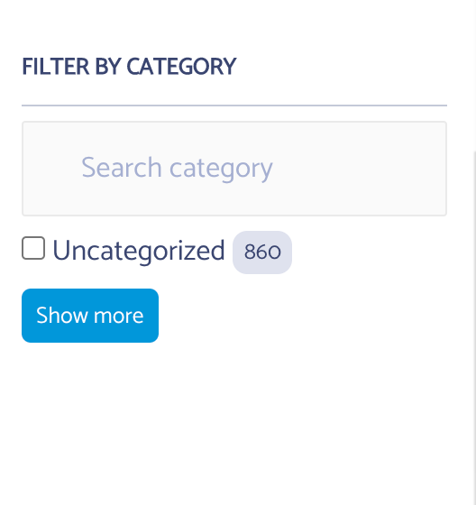

#Customizing Instant Search Widgets

Since version 1.1.4 of the plugin two new filters have been added to customize Facets and the sort by widgets

- Facets  : ```cm_typesense_search_facet_settings``` 
- Sort BY : ```cm_typesense_search_sortby_items```

##Facet Customization
To customize facets you can use the settings than can be passed to the refinementList, see available values [here](https://www.algolia.com/doc/api-reference/widgets/refinement-list/js/)

A short example would be making Facet searchable and limit

```
function cm_typesense_facet_modifications( $facet_settings, $facet ) {
	if ( $facet == 'category' ) {
		$facet_settings = [
			'searchable' => true,
			'limit'      => 1
		];
	}

	return $facet_settings;
}

add_filter( 'cm_typesense_search_facet_settings', 'cm_typesense_facet_modifications', 10, 2 );
```
Here I'm checking that the facet is "category" and if it is I am modifying it to make the filter searchable and limit it to 1 result at time.


*End Result*

##Sort By Customization
You can only add items to sort by, to allow sorting by various fields. A word of caution this is dependent on your schema so please make sure you are only adding sortable fields here. You should see what are sortable fields in Typesense documentation [here](https://typesense.org/docs/0.22.1/api/documents.html#arguments) 

Example to add sort by comment count the following code will work.

```
function cm_typesense_sortby_items( $items, $post_type ) {
    if ( $post_type == 'post' ) {
        $items[] = [ 'label' => 'Highest Comment Count', 'value' => $post_type . '/sort/comment_count:desc' ];
    }

	return $items;
}

add_filter( 'cm_typesense_search_sortby_items', 'cm_typesense_sortby_items', 10, 2 );
```


*End Result*