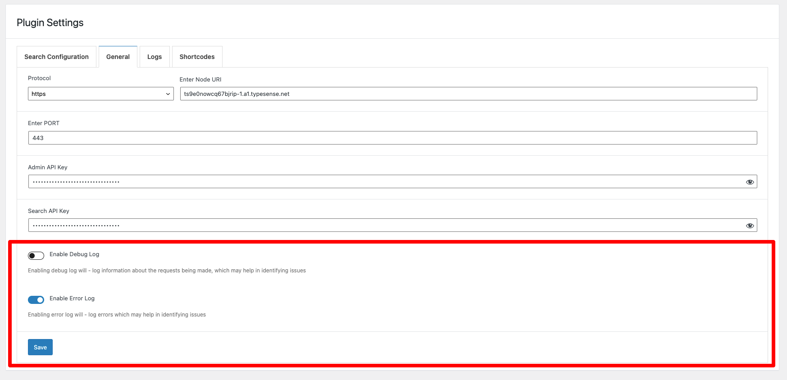

#Debugging

There are two types of logs:
- Error Log
- Debug Log

By default, Error Logs are enabled - you can disable them if you want. To do so go to WordPress Dashboard > Typesense > Settings 

**Dates for logs are all in UTC time for uniformity**

##Error Logs:
Error logs are logged if there is an error when a request is made to the Typesense node
Some of the examples
1) Connection to Node cannot be established
2) There was an error when inserting the document to the collection
3) Error creating collection
etc.

##Debug Log:
Debug log - logs every successful request made to Typesense. You can see the details of what is being sent to the node
Another use for debug log would be when bulk indexing documents - if for some reason an error log is not generated and documents aren't being added to collection.
You should turn on debug log - and view the log files - this is helpful to see when 
1) For some reason a single post is not indexed - while bulk indexing
2) Bulk indexing does not index all posts / post_types.

