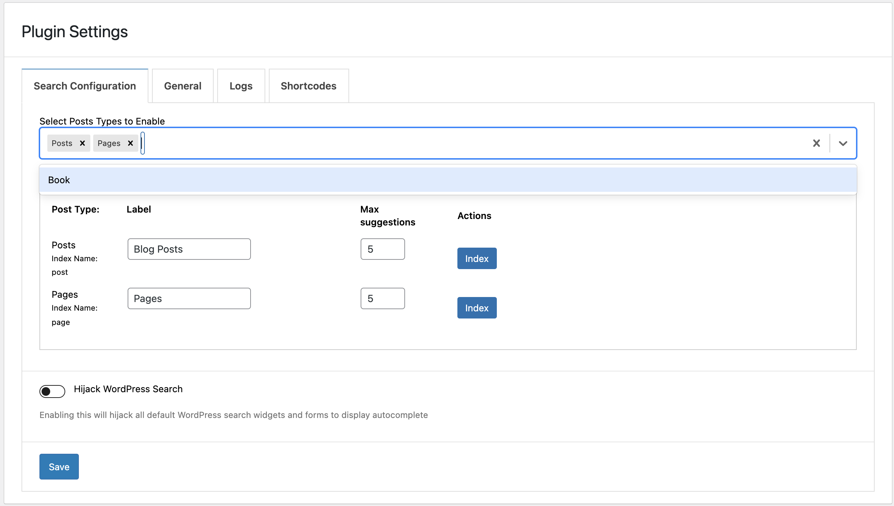

#Adding Custom Post Type#
## Introduction
By default, the plugin supports posts and pages for indexing. Adding additional / custom post types can be achieve via filter hooks.
There are three things you should be aware of.

1. [Adding the custom post type to available post types for indexing](#adding-custom-post-type_1)
2. [Adding schema for your custom post type](#adding-schema)
3. [Formatting data before documents are added](#formatting-data)

For this guide - we have assumed that the custom post type is book, please note that the `slug` of custom post type is quite important.

```
/**
 * Register a custom post type called "book".
 *
 * @see get_post_type_labels() for label keys.
 */
function wp_docs_codex_book_init() {
	$labels = array(
		'name'                  => _x( 'Books', 'Post type general name', 'textdomain' ),
		'singular_name'         => _x( 'Book', 'Post type singular name', 'textdomain' ),
		'menu_name'             => _x( 'Books', 'Admin Menu text', 'textdomain' ),
		'name_admin_bar'        => _x( 'Book', 'Add New on Toolbar', 'textdomain' ),
		'add_new'               => __( 'Add New', 'textdomain' ),
		'add_new_item'          => __( 'Add New Book', 'textdomain' ),
		'new_item'              => __( 'New Book', 'textdomain' ),
		'edit_item'             => __( 'Edit Book', 'textdomain' ),
		'view_item'             => __( 'View Book', 'textdomain' ),
		'all_items'             => __( 'All Books', 'textdomain' ),
		'search_items'          => __( 'Search Books', 'textdomain' ),
		'parent_item_colon'     => __( 'Parent Books:', 'textdomain' ),
		'not_found'             => __( 'No books found.', 'textdomain' ),
		'not_found_in_trash'    => __( 'No books found in Trash.', 'textdomain' ),
		'featured_image'        => _x( 'Book Cover Image', 'Overrides the “Featured Image” phrase for this post type. Added in 4.3', 'textdomain' ),
		'set_featured_image'    => _x( 'Set cover image', 'Overrides the “Set featured image” phrase for this post type. Added in 4.3', 'textdomain' ),
		'remove_featured_image' => _x( 'Remove cover image', 'Overrides the “Remove featured image” phrase for this post type. Added in 4.3', 'textdomain' ),
		'use_featured_image'    => _x( 'Use as cover image', 'Overrides the “Use as featured image” phrase for this post type. Added in 4.3', 'textdomain' ),
		'archives'              => _x( 'Book archives', 'The post type archive label used in nav menus. Default “Post Archives”. Added in 4.4', 'textdomain' ),
		'insert_into_item'      => _x( 'Insert into book', 'Overrides the “Insert into post”/”Insert into page” phrase (used when inserting media into a post). Added in 4.4', 'textdomain' ),
		'uploaded_to_this_item' => _x( 'Uploaded to this book', 'Overrides the “Uploaded to this post”/”Uploaded to this page” phrase (used when viewing media attached to a post). Added in 4.4', 'textdomain' ),
		'filter_items_list'     => _x( 'Filter books list', 'Screen reader text for the filter links heading on the post type listing screen. Default “Filter posts list”/”Filter pages list”. Added in 4.4', 'textdomain' ),
		'items_list_navigation' => _x( 'Books list navigation', 'Screen reader text for the pagination heading on the post type listing screen. Default “Posts list navigation”/”Pages list navigation”. Added in 4.4', 'textdomain' ),
		'items_list'            => _x( 'Books list', 'Screen reader text for the items list heading on the post type listing screen. Default “Posts list”/”Pages list”. Added in 4.4', 'textdomain' ),
	);

	$args = array(
		'labels'             => $labels,
		'public'             => true,
		'publicly_queryable' => true,
		'show_ui'            => true,
		'show_in_menu'       => true,
		'query_var'          => true,
		'rewrite'            => array( 'slug' => 'book' ),
		'capability_type'    => 'post',
		'has_archive'        => true,
		'hierarchical'       => false,
		'menu_position'      => null,
		'supports'           => array( 'title', 'editor', 'author', 'thumbnail', 'excerpt', 'comments' ),
	);

	register_post_type( 'book', $args );
}

add_action( 'init', 'wp_docs_codex_book_init' );
/**
 * Create two taxonomies, genres and writers for the post type "book".
 *
 * @see register_post_type() for registering custom post types.
 */
function wp_docs_create_book_taxonomies() {
	// Add new taxonomy, make it hierarchical (like categories)
	$labels = array(
		'name'              => _x( 'Genres', 'taxonomy general name', 'textdomain' ),
		'singular_name'     => _x( 'Genre', 'taxonomy singular name', 'textdomain' ),
		'search_items'      => __( 'Search Genres', 'textdomain' ),
		'all_items'         => __( 'All Genres', 'textdomain' ),
		'parent_item'       => __( 'Parent Genre', 'textdomain' ),
		'parent_item_colon' => __( 'Parent Genre:', 'textdomain' ),
		'edit_item'         => __( 'Edit Genre', 'textdomain' ),
		'update_item'       => __( 'Update Genre', 'textdomain' ),
		'add_new_item'      => __( 'Add New Genre', 'textdomain' ),
		'new_item_name'     => __( 'New Genre Name', 'textdomain' ),
		'menu_name'         => __( 'Genre', 'textdomain' ),
	);

	$args = array(
		'hierarchical'      => true,
		'labels'            => $labels,
		'show_ui'           => true,
		'show_admin_column' => true,
		'query_var'         => true,
		'rewrite'           => array( 'slug' => 'genre' ),
	);

	register_taxonomy( 'genre', array( 'book' ), $args );

	unset( $args );
	unset( $labels );

	// Add new taxonomy, NOT hierarchical (like tags)
	$labels = array(
		'name'                       => _x( 'Writers', 'taxonomy general name', 'textdomain' ),
		'singular_name'              => _x( 'Writer', 'taxonomy singular name', 'textdomain' ),
		'search_items'               => __( 'Search Writers', 'textdomain' ),
		'popular_items'              => __( 'Popular Writers', 'textdomain' ),
		'all_items'                  => __( 'All Writers', 'textdomain' ),
		'parent_item'                => null,
		'parent_item_colon'          => null,
		'edit_item'                  => __( 'Edit Writer', 'textdomain' ),
		'update_item'                => __( 'Update Writer', 'textdomain' ),
		'add_new_item'               => __( 'Add New Writer', 'textdomain' ),
		'new_item_name'              => __( 'New Writer Name', 'textdomain' ),
		'separate_items_with_commas' => __( 'Separate writers with commas', 'textdomain' ),
		'add_or_remove_items'        => __( 'Add or remove writers', 'textdomain' ),
		'choose_from_most_used'      => __( 'Choose from the most used writers', 'textdomain' ),
		'not_found'                  => __( 'No writers found.', 'textdomain' ),
		'menu_name'                  => __( 'Writers', 'textdomain' ),
	);

	$args = array(
		'hierarchical'          => false,
		'labels'                => $labels,
		'show_ui'               => true,
		'show_admin_column'     => true,
		'update_count_callback' => '_update_post_term_count',
		'query_var'             => true,
		'rewrite'               => array( 'slug' => 'writer' ),
	);

	register_taxonomy( 'writer', 'book', $args );
}

// hook into the init action and call create_book_taxonomies when it fires
add_action( 'init', 'wp_docs_create_book_taxonomies', 0 );
```

## Adding Custom Post Type

The hook in question to use is : `cm_typesense_available_post_types`
```
/*** Adds the post type book under available post_types ***/
function cm_typesense_add_available_post_types( $available_post_types ) {
	$available_post_types['book'] = [ 'label' => 'Book', 'value' => 'book' ];

	return $available_post_types;
}
add_filter( 'cm_typesense_available_post_types',  'cm_typesense_add_available_post_types');
```
This will add your custom post type to the available post types dropdown in the backend. Which will allow you to enable the post type and index it.

IMPORTANT NOTE: Please note the index and value MUST be the post_slug

Result:


## Adding Schema

Your schema for the custom post type would most likely need to be different for your custom post type. For example you may want to send custom taxonomies as facets for your post type. To do so you will need to modify / add your schema - BEFORE - any indexing is done

IMPORTANT NOTE: SCHEMA NEEDS TO BE DEFINED BEFORE COLLECTION IS CREATED.

```
//only necessary if the default post schema is not necessary
function cm_typesense_add_book_schema( $schema, $name ) {
	if ( $name == 'book' ) {
		$schema = [
			'name'                  => 'book',
			'fields'                => [
				[ 'name' => 'post_content', 'type' => 'string' ],
				[ 'name' => 'post_title', 'type' => 'string' ],
				[ 'name' => 'post_type', 'type' => 'string' ],
				[ 'name' => 'post_author', 'type' => 'string' ],
				[ 'name' => 'comment_count', 'type' => 'int64' ],
				[ 'name' => 'is_sticky', 'type' => 'int32' ],
				[ 'name' => 'post_excerpt', 'type' => 'string' ],
				[ 'name' => 'post_date', 'type' => 'string' ],
				[ 'name' => 'post_id', 'type' => 'string' ],
				[ 'name' => 'post_modified', 'type' => 'string' ],
				[ 'name' => 'id', 'type' => 'string' ],
				[ 'name' => 'permalink', 'type' => 'string' ],
				[ 'name' => 'post_thumbnail', 'type' => 'string' ],
				[ 'name' => 'genre', 'type' => 'string[]', 'facet' => true ]
			],
			'default_sorting_field' => 'comment_count'
		];
	}


	return $schema;
}

add_filter( 'cm_typesense_schema', 'cm_typesense_add_book_schema', 10, 2 );
```

In the example above - you can see genre is being sent as a facet. "genre" is the custom taxonomy attached to the book post type.


## Formatting Data

```
//you can modify the code as needed 
//if your schema is simillar to the default post type then you should only change what fields you need to add
//example here we are only adding genre
function cm_typesense_format_book_data ( $formatted_data, $raw_data, $object_id, $schema_name ) {
	if ( $schema_name == 'book' ) {
		$terms  = get_the_terms( $object_id, 'genre' );
		$genres = [];
		foreach ( $terms as $term ) {
			$genres[] = $term->name;
		}
		$formatted_data['genre'] = $genres;
	}

	return $formatted_data;
}
add_filter( 'cm_typesense_data_before_entry', 'cm_typesense_format_book_data', 10, 4 );
```