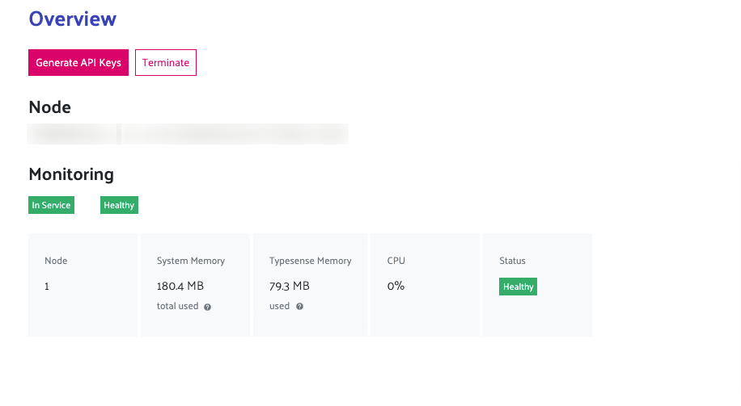

# Getting Started

## Generate API Keys
Before you do anything else, you must first add the API keys and configure the node.

If you are hosting Typesense locally / on your own server.
Then please see the steps here to generate API Keys
<a href="https://typesense.org/docs/0.22.1/api/api-keys.html" target="_blank" rel="no-opener no-follow" >https://typesense.org/docs/0.22.1/api/api-keys.html</a>

Otherwise, if you have gone with Typesense cloud option - then once the cluster is set up. There will be an option to generate your API keys.

*Above Shows overview of API Keys*

Clicking "Generate API Keys" - will generate and download API Keys to be used. Keep this file safe and secure for future use.

The Text file will have the following information

* Protocol: [https]
* Port: [443]
* Admin API Key
* Search Only API Key
* Node

## Configuring Plugin
### Saving Settings
After retrieving the required info go to 
WordPress > Admin Area > Typesense > Settings You will be guided to a page like so.

Here - enter the details provided in the text file and click save.
Your WordPress install will now be able to connect to your typensese instance.

## Setup Autocomplete and Indexing
The next step is to enable and start indexing your posts.

Going to Admin Area > Typesense 

Here you can 

1. Enable which post types should be indexed
2. Bulk index the selected post types
3. Hijack WordPress Search to show autocomplete

### Enable Post Types
This option allows you to select which post types to index.
By default the plugin allows you to index posts and pages.
Pro version of the plugin will be needed to index custom post types.

### Bulk Index
Bulk Index option allows you to index all posts(post types) at once.
Indexing means they will add the document into Typesense instant to be easily retrieved.

### Hijack WordPress Search
When this option is enabled it will replace all search forms that use
default WordPress search with autocomplete.
Developer Note: It will replace all calls for get_search_form() and the default WordPress search widget or "core/search" block used

