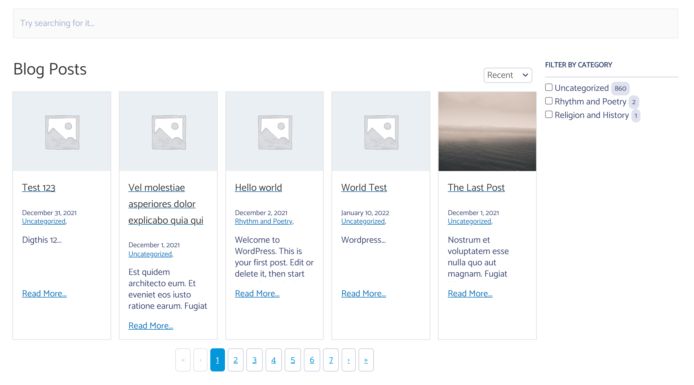

Overriding the template allows you to change things of the output for your autocomplete or instant search design as you need to.

- Plugin base folder: `search-with-typesense/templates`

The templates are in the plugin `serach-with-typesense/templates` and you can override it by copying it to your child theme.

To override, copy files from `wp-content/plugins/search-with-typesense/templates/` folder to `wp-content/themes/your-theme/search-with-typesense/`,

Then you can make the changes as you need. For example if you want the filters to show up on the right instead of the left.
Copy the file `instant-search.php` from `wp-content/plugins/search-with-typesense/templates/` to `wp-content/themes/your-theme/search-with-typesense/instant-search.php`.
And change the div structure so that main-panel is first and filter-panel is second.

*End Result:*


*Below is sample of code - please change the template by copying from parent* 

```
    <div class="main-panel">
        <div class="cm-typesense-search-results-wrapper">
            <div class="cm-typesense-search-posts-pages-results-wrapper">
				<?php
				foreach ( $args['post_types'] as $post_type ) {// echo '<pre>'; var_dump( $config ); echo '</pre>';
					?>
                    <div class="cm-typesense-shortcode-search-heading">
                        <h2 class="cm-typesense-shortcode-search-title">
							<?php
							$title = ( isset( $config['config']['post_type'][ $post_type ]['label'] ) && $config['config']['post_type'][ $post_type ]['label'] != '' ) ? $config['config']['post_type'][ $post_type ]['label'] : $config['available_post_types'][ $post_type ]['label'];
							echo esc_html( $title ); ?>
                        </h2>
                        <div class="cm-typesense-shortcode-search-<?php echo esc_html( $post_type ); ?>-sortby cm-typesense-sortby"></div>
                    </div>

                    <div class="cm-typesense-shortcode-search-<?php echo esc_html( $post_type ) ?>-result"></div>
                    <div class="cm-typesense-pagination cm-typesense-shortcode-search-<?php echo esc_html( $post_type ); ?>-pagination"></div>
				<?php } ?>
            </div>
        </div>
    </div>
	<?php if ( $args['filter'] === 'show' && 1 === count( $args['post_types'] ) ) { ?>
        <div class="filter-panel">
			<?php
			foreach ( $facet as $filters ) {
				foreach ( $filters as $filter ) { ?>
                    <div class="cm-typesense-shortcode-search-<?php echo esc_html( $filter ); ?>-filters"
                         data-title ="<?php  esc_html_e( sprintf( 'Filter by %s', ucwords( esc_html( $filter ) ) ), 'search-with-typesense' ); ?>"
                    ></div>
				<?php }
			}
			?>
        </div>
	<?php } ?>
```
