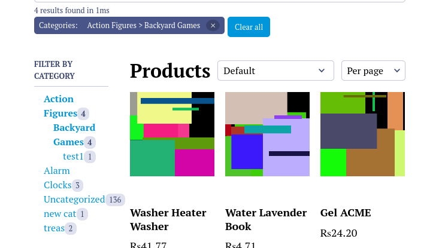

# Introduction #

Typsense Search for WooCommerce is a premimum addon that provides robust, fast search functionality for WooCommerce products on your website. 

## Features 

* Lightning-fast products search results in miliseconds
* Allow to override WooCommerce product search
* Allow to hijack WooCommerce shop and archive pages
* Provides result in WooCommerce default HTML structure
* Provides all the features for search and filter provided by WooCommerce but in a better and fast way
* Provides shortcodes for adding search in only specific locations.
* Hooks and filters for customizations
* Template Override for design customizations.


## Minimum Requirements

* PHP 7.4 required or greater
* MySQL 5.6 or greater is recommended
* <a href="https://wordpress.org/plugins/search-with-typesense/" target="_blank" rel="no-opener no-follow" >Search with Typsense</a>
* <a href="https://wordpress.org/plugins/woocommerce/" target="_blank" rel="no-opener no-follow" >WooCommerce</a>
---

## Installation
1. After purchasing from [Codemanas](https://codemanas.com/), download the zip file
1. Then on your site's dashboard, go to **WordPress Plugins > Add New > Search for "Search with Typesense"**
2. Click Install and then activate Plugin 
---


## Getting started

### Activate License
After activating the plugin, go to **Typesense->Addons**, then activate the license.


### Indexing products

First you need to index i.e. push data to Typsense cloud. To do so, follow the below steps:

1. Go to **Typsense->Typesense**
2. Select the **Products** post type from the dropdown in **Select Posts Types to Enable**
3. Then you can set the Products' **label** and **max suggetion** to be listed on autocomplete.
4. After that, click the **Index** button to index. It may take few minutes depending upon the number of products you have.
5. When the indexing is complete, you will get the success message and process is complete.


### Settings

The plugin provides the following default settings at **Typesense->WooCommerce**:

1. **Hijack Shop page** - Hijack shop page listing by the instant search

2. **Filters**
	* **Enable category** - Enable category filtering
	* **Enable price** - Enable price filtering
	* **Enable rating** - Enable filtering by rating
	* **Enable attributes** - Enable filter by attributes
	* **Enable sortby** - Enable sortby

3. **Pagination** - Enable pagination

4. **Routing** - Enabling this option will activate routing, allowing you to share the URL with the applied filter.

5. **Show featured products first** - Display featured products first while filtering or searching products

6. **Search placeholder** - Change placeholder text on the shop's search

7. **Hijack Product Search** - Hijack WooCommerce search widget and block with Autocomplete.


**Note:** Same settings are provided in **Dashboard->Customize** then **WooCommerce->Typesense Settings** for previewing the live changes.


## Shortcodes

## Instant search
Displays the instant search with products.

`[cm_tsfwc_search cat_filter='show' price_filter='show' rating_filter='show' attribute_filter='show' pagination='show' sortby='show' placeholder='Search products...' show_featured_first='no']`

##### Options:

**cat_filter**

* Value: `show` or `hide`
* Description: Determines the showing or hiding of the category filter
* Default value: "show"

**price_filter**

* Value: `show` or `hide`
* Description: Determines the showing or hiding of the price filter
* Default value: "show"

**rating_filter**

* Value: `show` or `hide`
* Description: Determines the showing or hiding of the rating filter
* Default value: "show"

**attribute_filter**

* Value: `show` or `hide`
* Description: Determines the showing or hiding of the attribute filter
* Default value: "show"

**pagination**

* Value: `show` or `hide`
* Description: Determines the showing or hiding of pagination
* Default value: "show"

**routing**

* Value: `enalbe` or `disable`
* Description: Enabling this will activate routing, allowing you to share the URL with the applied filter.
* Default value: "disable"

**sortby**

* Value: `show` or `hide`
* Description: Determines the showing or hiding of the sortby filter
* Default value: "show"

**placeholder**

* Value: Any string
* Description: Placeholder text for the search input field
* Default value: "Search products"

**show_featured_first**

* Value: `yes` or `no`
* Description: Show the featured products first on the listing while searching or filtering
* Default value: "no"

***query_by***

* Values: string (Advanced Usage [the typesense documentation](https://typesense.org/docs/0.22.1/api/documents.html#search))
* Description: Query results by these fields
* Default: `post_title,post_content`

## Autocomplete search

Displays the autocomplete form to search products.

`[cm_tsfwc_autocomplete_search placeholder="Search products"]`

##### Options:

**placeholder**

* Value: string
* Description: Placeholder text for the search form
* Default value: empty

## Template Overwriting

Overriding the template allows you to change the output for the product listing design as you need to.

The templates are in the plugin `typesense-search-for-woocommerce/templates` and you can override it by copying it to your theme.

To override, copy files from `wp-content/plugins/typesense-search-for-woocommerce/templates/` folder to `wp-content/themes/your-theme/search-with-typesense/woocommerce`. Then you can make the changes as you need.


For example: if you want the filters to show up on the right instead of the left. 

* Copy the file `instant-search.php` from `typesense-search-for-woocommerce/templates/instant-search.php` to `your-theme/search-with-typesense/woocommerce/instant-search.php`. 

* And change the div structure so that `filter-panel` is after `main-panel`.

*End result:*


## Action Hooks & Filter Hooks / Extending Plugin
There are plenty of Hooks and Filters provided by the plugin to allow developers to customize or add additional functionality to the plugin
### Filter Hooks:
Please see [https://developer.wordpress.org/plugins/hooks/filters/](https://developer.wordpress.org/plugins/hooks/filters/) for details of what filters are in WordPress.

**cm_tsfwc_per_page_config**

* Description: Change the per page listing and values
* Arguments: `$per_page_config` Array of configs with label and value	
* Default value:
```
	[
		[ 'label' => 'Per page', 'value' => $atts['per_page'], 'default' => true ],
		[ 'label' => '10 per page', 'value' => 10 ],
		[ 'label' => '20 per page', 'value' => 20 ],
		[ 'label' => '30 per page', 'value' => 30 ],
		[ 'label' => '40 per page', 'value' => 40 ],
		[ 'label' => '50 per page', 'value' => 50 ],
	]
```

**cm_tsfwc_product_fields**

* Description: Add new fields to schema to be indexed.
* Arguments: `$product_fields` Array of fields to be indexed.

**cm_tsfwc_data_before_entry**

* Description: Add the formatted data to the added fields.
* Arguments:
	* `$formatted_data` Array of data to be returned.
	* `$raw_data` Raw data containing product object 
	* `$object_id` Object ID passed
	* `$schema_name` Name of the schema which is `product` in this case.

### Action Hooks:
Please see [https://developer.wordpress.org/plugins/hooks/actions/](https://developer.wordpress.org/plugins/hooks/actions/) for details of what action hooks are in WordPress.


**cm_tsfwc_custom_attributes**

* Description: Hook to add custom attributes HTML to the structure
* Location: `templates/instant-search.php`

## Change per page dropdown values on frontend

### Use Case:
What if you want to change the 10 per page, 20 per page and so on value to your own custom, let's say 50 per page, 100 per page and so on.

### How to do it:
The plugin provides a filter: `cm_tsfwc_per_page_config` to change it.

You can use it like below:

```
add_filter( 'cm_tsfwc_per_page_config', 'your_slug_change_per_page' );

function your_slug_change_per_page( $per_page_config ) {
	$per_page_config = [
		[ 'label' => '50 per page', 'value' => 50, 'default' => true ], // one value should always have 'default' => true
		[ 'label' => '100 per page', 'value' => 100 ],
		[ 'label' => '150 per page', 'value' => 150 ],
		[ 'label' => '200 per page', 'value' => 200 ],
	];
	return $per_page_config;
}
```


## Adding custom taxonomy as filters

### Use Case:
Suppose you want to add tags ( or any other custom taxonomy ) filter to the shop/archive page other than the default ones provided by the addon. 

### How to do it:

#### Format the document data to be indexed as Facet
To add a new Facet you need to add it as .*_attribute_filter, so if you want to add product_tags  you can add it as 
product_tags_attribute_filter
```
add_filter( 'cm_tsfwc_data_before_entry', 'your_slug_add_data_before_entry', 10, 4 );

function your_slug_add_data_before_entry( $formatted_data, $raw_data, $object_id, $schema_name ) {

	if( $schema_name === 'product' ) { // only add data if the schema is product 

		$product_tags = get_the_terms( $object_id, 'product_tag' );

		$product_tags_arr = [];

		if( ! is_wp_error( $product_tags ) ) {
			foreach( $product_tags as $product_tag ) {
				$product_tags_arr[] = $product_tag->name;
			}
		} else {
			$product_tags_arr = []; // Only array can be pushed to the data. When no data, empty array is the must
		}

		$formatted_data['product_tags_attribute_filter'] = $product_tags_arr;
	}

	return $formatted_data;

}

```

### Displaying the filter

To display the filter on the frontend, use the action hook `cm_tsfwc_custom_attributes` like below:

data-attr_facet_data-facet_name
```
add_action( 'cm_tsfwc_custom_attributes', 'your_slug_add_custom_attr' );

function your_slug_add_custom_attr() {
	echo '<div 
	data-attr_facet_name="product_tags_attribute_filter" 
	data-title ="' . __( "Filter by Tags", 'storefront' ) . '" 
	data-attr_label ="' . __( "Tags", 'storefront' ) . '"
	class="cm-tsfwc-shortcode-tags-attribute-filters" 
	data-filter_type="refinementList"
    data-settings="' . _wp_specialchars( json_encode( [ "searchable" => false ] ), ENT_QUOTES, "UTF-8", true ) . '"
	></div>';
}

```

* `data-attr_facet_name`: It should same as the name of the field added before. 
				   For example: here name of the field added before is `'product_tags_attribute_filter'` so the `data-attr_facet_name` should be `product_tags_attribute_filter`

* `data-title`: Title for the filter

* `data-filter_type`: Type of filter to use
	* Values: `refinementList` `rangeSlider` `rangeInput` `menu`

	* *Note:  For `rangeSlider` and `rangeInput` the schema for field must be `int64`*

## Adding static code / widgets to the sidebar

### Use Case:
Suppose you want to add default WooCommerce widgets like *Top Rated Products* below the filters

### How to do it:

#### Use `cm_tsfwc_filter_panel_output` hook

```
add_action( 'cm_tsfwc_filter_panel_output', 'mytheme_add_widgets',40 );

function mytheme_add_widgets() {
	the_widget( 'WC_Widget_Top_Rated_Products' );
}

```


## Removing attribute filter

### Use Case:
Suppose you want to remove Filter by `size` filter.

#### Use `cm_tsfwc_attribute_facet_skip` hook

```
add_filter( 'cm_tsfwc_attribute_facet_skip', 'mytheme_hide_attribute_facet' );

function mytheme_hide_attribute_facet() {
	return ['book-author'];
}
```

## Changing attribute widget type

### Changing type of widget in Category filter

```
function your_slug_change_cat_filter_type( $filterType ) {
    
    $filterType = 'menu';

    return $filterType;
}

add_filter( 'cm_tsfwc_category_filter_type', 'your_slug_change_cat_filter_type' );
```

** Acceptable filter type = `refinementList`, `menu` **

### Changing type of widget in Price filter

```
function your_slug_change_price_filter_type( $filterType ) {
      
    $filterType = 'rangeSlider';

    return $filterType;
}

add_filter( 'cm_tsfwc_price_filter_type', 'your_slug_change_price_filter_type' );
```

** Acceptable filter type = `rangeSlider`, `rangeInput` **

### Changing type of widget in Rating filter

```
function your_slug_change_rating_filter_type( $filterType ) {
      
    $filterType = 'rangeSlider';

    return $filterType;
}

add_filter( 'cm_tsfwc_rating_filter_type', 'your_slug_change_rating_filter_type' );
```

** Acceptable filter type = `ratingMenu`, `rangeSlider`, `rangeInput` **

### Changing type of widget in Attribute filters

```
function your_slug_change_attribute_filter_type( $filterType, $attributeName ) {

    if ( $attributeName == 'size' ) {
        $filterType = 'menu';
    }

    return $filterType;
}

add_filter( 'cm_tsfwc_attribute_filter_type', 'your_slug_change_attribute_filter_type', 10, 2 );
```

** Acceptable filter type = `refinementList`, `menu` `rangeInput`, `rangeSlider` **

*Note:  For `rangeSlider` and `rangeInput` the schema for field must be `int64`*

## Adding/changing facets settings

### Changing facet settings in Category filter

```
function your_slug_change_facet_setting( $filterSettings ) {
      
    $filterSettings = [ 'searchable' => true ];

    return $filterSettings;
}

add_filter( 'cm_tsfwc_category_facet_settings', 'your_slug_change_facet_setting' );
```

See <a href="https://www.algolia.com/doc/api-reference/widgets/refinement-list/js/" target="_blank">here</a> for available options.

*Note: `container` and `attribute` are not overridable*


### Changing facet settings in Price filter

```
function your_slug_change_facet_setting( $filterSettings ) {
      
    $filterSettings = [ 'pips' => false ];

    return $filterSettings;
}

add_filter( 'cm_tsfwc_price_facet_settings', 'your_slug_change_facet_setting' );
```

See <a href="https://www.algolia.com/doc/api-reference/widgets/range-slider/js/" target="_blank">here</a> for available options.

*Note: `container` and `attribute` are not overridable*


### Changing facet settings in Rating filter

```
function your_slug_change_facet_setting( $filterSettings ) {
      
    $filterSettings = [ 'max' => 5 ];

    return $filterSettings;
}

add_filter( 'cm_tsfwc_rating_facet_settings', 'your_slug_change_facet_setting' );
```

See <a href="https://www.algolia.com/doc/api-reference/widgets/rating-menu/js/" target="_blank">here</a> for available options.

### Changing facet settings in Custom Attribute filter

```
function your_slug_change_facet_setting( $filterSettings, $attrName ) {
    
    if( 'color' == $attrName ) {
    	$filterSettings = [ 'searchable' => true ];
	}

    return $filterSettings;
}

add_filter( 'cm_tsfwc_attribute_facet_settings', 'your_slug_change_facet_setting', 10, 2 );
```

See <a href="https://www.algolia.com/doc/api-reference/widgets/refinement-list/js/" target="_blank">here</a> for available options.

*Note: `container` and `attribute` are not overridable*

##WPML Integration
As of version 1.2.4 of Typesense search for WooCommerce - the plugin is compatible with WPML and adds features to integrate with WPML + WooCommerce
The plugins required for WPML Integration are :
### Pre-requisites
- [WooCommerce Multilingual](https://wpml.org/documentation/related-projects/woocommerce-multilingual/)
- [WPML 4.4.11 or aboves](https://wpml.org/)
- WPML String Translation
- WPML Translation Management (not needed for WooCommerce 3.9.0)
- Typesense Search for WooCommerce

If you want to use different media (images) for different translations of a product, you need to install [WPML Media](https://wpml.org/documentation/getting-started-guide/media-translation/).

###WPML Translation modes and tools
There are two different translation modes while using WPML. Please see WPML documentation for detailed information.

- [Translate Everything](https://wpml.org/documentation/getting-started-guide/#translate-everything) :
  All of the site’s main content will be automatically translated into all secondary languages as content is published
  or updated. Translations can then be reviewed on the front-end and edited by the user (or local translator) if
  needed.
- [Translate Some](https://wpml.org/documentation/getting-started-guide/#translate-everything) :
  Users can pick and choose what to translate, when to translate it, and who will translate it.
  This mode allows for content to be translated manually, translated via WPML’s Advanced Translation Editor, translated by professional translation services , or even translated
  by a team of local translators.

###Translating Content:
For translation of content - there is nothing new you need to do on the typesense plugin. Based on your setup the WooCommerce Products, Pages (checkout, cart, my-account etc), translations are handled by the WooCommerce Multilingual plugin - please see [translating products](https://wpml.org/documentation/related-projects/woocommerce-multilingual/#translating-products)

What is required for Typesense integration is only on initial installation. You would need to index your products for each language you have.

###Indexing Products:
To index products you will need to go to WP Admin > Typesense
Here you will be shown the Typesense Search Config settings and you can index the products.
The only difference here is to switch language on your admin screen for each of your language to index your products.
This step - is a one time step - meaning it only needs to be done once - when the plugin is initially configured.
Please see video for a small walk through.
<div style="padding:55.77% 0 0 0;position:relative;"><iframe src="https://player.vimeo.com/video/696013350?h=1446c77049&amp;badge=0&amp;autopause=0&amp;player_id=0&amp;app_id=58479" frameborder="0" allow="autoplay; fullscreen; picture-in-picture" allowfullscreen style="position:absolute;top:0;left:0;width:100%;height:100%;" title="Indexing Products - WPML Integration"></iframe></div><script src="https://player.vimeo.com/api/player.js"></script>
Once the indexing is complete, all your current products will show up in the shop and users will be show the products based on the current language the user has selected.
For new products - they will be indexed to the correct translation - when they are added / updated. And will be removed if they are deleted / status visibility of product is changed.

###Translating Plugin Strings
Some strings are hardcoded into the plugin and will require string translation. You can see detailed documentation for string translation [here](https://wpml.org/documentation/getting-started-guide/string-translation/).
Please see this short video on how to translate strings.
<div style="padding:55.77% 0 0 0;position:relative;"><iframe src="https://player.vimeo.com/video/696020799?h=790e135fe5&amp;badge=0&amp;autopause=0&amp;player_id=0&amp;app_id=58479" frameborder="0" allow="autoplay; fullscreen; picture-in-picture" allowfullscreen style="position:absolute;top:0;left:0;width:100%;height:100%;" title="translating-plugin-strings"></iframe></div><script src="https://player.vimeo.com/api/player.js"></script>

*Note: `container` and `attribute` are not overridable*

## Making category menu filter a hierarchical menu

Hierarchical menu is a navigaton based on a hierarchy of attributes like category and it's subcategories. See below for example:



From version `1.3.5`, we have added an option to change the defalut category menu filter to hierarchical menu. Follow the below steps:

1. Go to **Dashboard -> Typesense -> WooCommerce**
2. In **Advance Settings**, enable the **Make the default Category filter hierarchical menu**
3. Click **Save Changes** button
4. After saving, you need to **Delete and Re-index** your Products from **Typesense->Typesense** in **Search Configuration** tab.

<span style="color: maroon;">*Please note that enabling this option will be resource heavy and may make your backend slow.*</span>

*This is because WooCommerce does not provide the default hierarchy of the products' categories and subcategories. So we have to manually query all the categoires and make a hierarchy which in itself is a heavy process. Further more, on adding, updating and deleting of a category, we have to repeat the proess and index again.*


## Additional search parameters for default search configuration

From version `1.3.7`, you can configure additional search parameters for both **Instant search** and **Autocomplete** using the filter hooks mentioned below:

`cm_tsfwc_additional_search_params` -  Configure instant search additional search parameters


`cm_tsfwc_additional_autocomplete_params` - Configure autocomplete search additional search parameters

Example code:


```
add_filter( 'cm_tsfwc_additional_search_params', 'theme_slug_alter_search_params' );
function theme_slug_alter_search_params() {
	return [
		'hidden_hits' => 3662,
		// 'query_by_weights' => '1,2', 
		// 'query_by' => "post_content,post_title",
		// 'sort_by' => 'total_sales:asc', // work only with numerical fields
		// 'filter_by' => 'post_title: test',
		// 'facet_by' => 'category,prices', // can not override so dont work
		// 'max_facet_values' => 1, // can not override so don't work
		// 'facet_query' => 'category_lvl0: Alaram',
		// 'num_typos' => 2,
		// 'page' => 2, // cannot override so don't work
		// 'group_by' => 'category',
		// 'highlightFullFields' => 'post_title,post_content,test',
		// 'include_fields' => 'price,prices',
		// 'pinned_hits' => '3662:2',
	];
}
```

You can refer here: [https://typesense.org/docs/0.23.1/api/search.html#search-parameters](https://typesense.org/docs/0.23.1/api/search.html#search-parameters) for additional parameters. 

*Note: Some parameters like `facet_by, q, max_facet_values, page` can not be overwritten. Others can be passed as required.*


## Search only after certain character length

From version `1.4.8`, you can configure search to be triggered after certain characters are typed on search bar. The new filter introduced is  `cm_tsfwc_search_query_length`

You can use the hook like below. The below code triggers search only when 4 character is typed on search bar:

```
add_filter( 'cm_tsfwc_search_query_length', 'your_slug_serach_after_char_count' ); 

function your_slug_serach_after_char_count( $count ) {
    $count = 4;
    return $count;
}

```